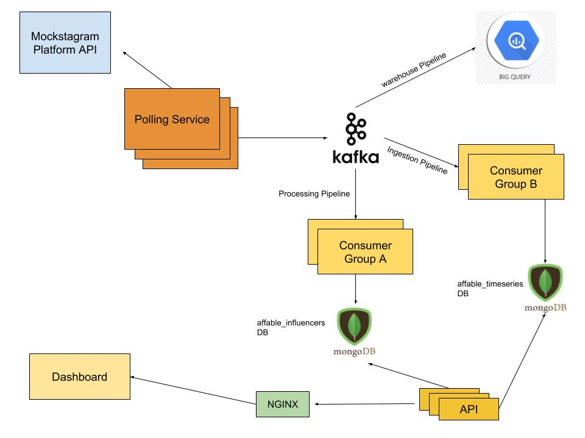
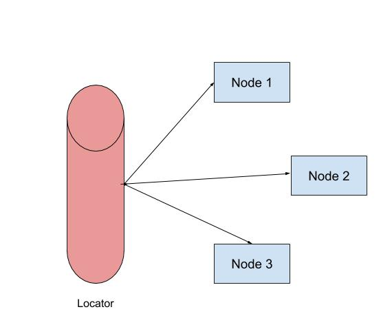
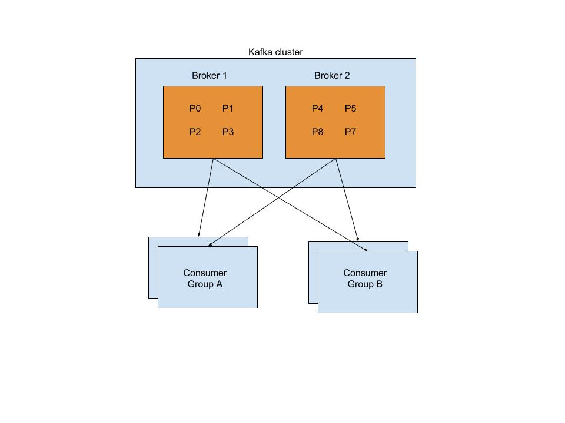
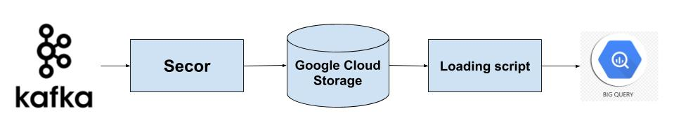

# Use cases and Constraints

### Use Cases
- Polling 1M influencers data every minute from Mockstargram API
- Show an influencer follower Count, following Count, follower ratio as time series graph on dashboard with a resolution of upto 1 minute.
- Showing latest data of an influencer and his/her rank.
- Showing average followers count across all influencers.
- Update suspicious influencer every day
- Solution is designed such that it can be scaled beyond current use case of 1M influencers.

### Constraints and Assumptions
- No rate limiting from Mockstagram API
- Mockstagram API responds with same time for every request i.e traffic is evenly distributed
- System’s read/write ratio is very low.
- We will continue polling suspicious influencers data from Mockstagram and store in DB. But they will not be influencing rank and average followersCount.
- Volume of data
> Size per transaction:
> created_at - 8 bytes
> pk (long) - 8 bytes
> username (VARCHAR(15)) - 16 bytes
> followerCount (long) - 8 bytes
> followingCount (long) - 8 bytes
> Total: ~ 48 bytes
> 1M transactions a minute 
> 1.4B transactions a day
> ~ 65GB a day

# High Level Design


# Core Components

## Polling Service
#### Use Case 
- This service pings Mockstagram API and publishes results in Kafka.
- It should be able to make 1M requests a minute.

#### Constraints:
- It should be highly fault tolerant to prevent any data loss.

#### Design 
> Assuming one request to Mockstagram API takes 100ms and a single nodejs instance can handle 1k concurrent connections (single core system). A single instance can process ~600K requests a minute. To make this system fault tolerant, we will scale this horizontally to 3 instances and use application level sharding.



- It is a stateless system. 
- There are 3 nodes (or instances) and a locator service. This service makes sure that all 3 nodes are available and rebalance load if one of them goes down. 
- Each node has an id which informs them of pk (influencer_id) they have to process.

Locator Service:
It maintains config in In-Memory cache
``` json
{
  "count": 3,
  "nodes": {
    "192.168.1.1": {
      "id": 1,
      "ts": "1537078033",
      "up": true
    },
    "192.168.1.2": {
      "id": 2,
      "ts": "1537078033",
      "up": true
    },
    "192.168.1.3": {
      "id": 3,
      "ts": "1537078033",
      "up": true
    }
  }
}
```
Two Endpoints:
``` sh
GET /api/v1/health/:ip
	Updates ts corresponding to ip and mark status as up
	Response - {“statusCode”: 200, “status”: OK}
```
``` sh
GET /api/v1/config/:ip
	Returns config corresponding to ip
	Response - {“statusCode”: 200, “config”: {“count”: 3, “id” : 1}}
```

Fault detection logic:
``` python
while true:
	for ip in config.nodes:
		if (now - ip.ts) > 3min:
			ip.up = false
			update_config()
	wait_1_minute
	
update_config():
	x=1
	for ip in config.nodes:
		if(ip.up):
			ip.id = x++
	config.count = --x
```

Node logic:
- Each node sends heartbeat (health url) at an interval of 1min to locator
- Each node polls mockstagram regularly with respective pks and publishes result in kafka topic

``` python
# initial config at t=0
config = fetch_config_from_locator()  
while true:
	res = fetch_config_from_locator()
	# case in which locator itself goes down, continue using old config
	if res.statusCode == 200:		
		config = res.config
	for each pk
		if (pk % config.count) == config.id:
			data = make_request_mockstagram()
			data.event_time = now()
			publish_message_to_kafka(data)
```

## Kafka Architechture
> Why Kafka?
> It stores data persistently, durable at high traffic, fault tolerant.
> Best for stream processing.
> It will act as a shock absorber in the data pipeline. Poller and streaming to DB will > function independently and can be scaled separately.
  
#### Architecture for our use case
``` sh
	Brokers - 2 
	Topics - single topic
	Partitions - 8 partitions for higher throughput.
```
- Partitioning logic: (pk % 8). It is based on pk because we need to maintain time series order.
- Consumer groups: 3 consumer groups each for data warehousing, data processing, and data ingestion.
- Format of data: JSON (for additional metadata, we can prefer other formats like transit)




## Data Processing pipeline
### Use cases:
Maintain updated profiles of influencers to get recent data, rank and average across all influencers
### Design
>Why Mongo ??
>Support for partial bulk updates
>Highly performant for our scale of data (1M influencers) and serve most of our use cases.
>Assuming our queries have simple criteria and we need frequent bulk partial updates. Otherwise we might choose some other store like Elasticsearch for complex queries.

### Architecture:
- Consumers: One consumer Group with 2 instances.
- Each consumer instance runs on 4 threads and hence process one topic partition each.
- It keeps profiles of influencers in in-memory cache. Assuming each document is 100bytes ~ 100MB size of 1M documents which is reasonable.
- Size of one document: 
>Keys - pk (8B), username (16B), updated_at (8B), followersCount (8B), followingCount (8B), suspicious (1B) => ~80B (with some additional metadata) 
1M documents in all => ~76MB

Logic:
``` json
<!--keeps profiles in application memory-->
profiles_cache = {					
	"1000001": {
		"pk": 1000001,
		"username": "influencer-1000001",
		"followerCount": 5000,
		"followingCount": 1356,
		“ready_to_sync?”: true
	},
	...
}
```
Read from kafka and update profiles locally. Mark ready_to_sync flag as true
``` python
while true:
	msg = read_from_kafka()
	update_profiles_cache(profiles[msg.pk])
```

Sync profiles_cache with MongoDB at regular interval
```
while true:
    <!--mongo bulk initialization-->
	bulk = initializeUnorderedBulkOp()		
	bulk_doc_count=0			
	for each pk in profiles_cache:
		if pk.ready_to_sync:
			bulk.find({"pk" : pk}).update(profiles_cache[pk])
			pk.ready_to_sync = false
			bulk_doc_count++
        <!--batching into 50K and then bulk API mongo-->
		if bulk_doc_count/50,000 == 0:	     
			bulk.execute()
			bulk = initializeUnorderedBulkOp()
			bulk_doc_count=0
			continue
	wait_for_1_min
```

Schema:
Database Name: affable_influencers, 
collection name: influencers
``` json
{
  "pk": "long UNIQUE",
  "username": "String",
  "followersCount": "long",
  "followingCount": "long",
  "suspicious": "boolean",
  "updated_at": "Date"
}
```
``` sh
db.influencers.createIndex({"followersCount" : 1, "pk" : 1})
```

Queries:
Updating influencers document in mongo
``` sh
db.find({"pk" : pk}).update({$set : { "followersCount" : followersCount, "followingCount": followingCount}})
```
Fetching recent data of an influencer
``` sh
db.influencers.find({"pk" : pk})
```
Fetching rank of an influencer
``` sh
db.influencers.aggregate([{$match : { "followersCount": { $gte: profile.followersCount }, "suspicious" : false}}, $group : {_id : { followersCount : "$followersCount"}, count : { $sum : 1}}])
```
Total bucket count of this query gives rank, and profile is the profile of queried influencer

Fetching average across all influencers
``` sh
db.influencers.aggregate([{$match : {"suspicious" : false}}, {$group: {_id: "pk", avgFollowers: {$avg: "$followersCount"}}}])
```
## Data ingestion Pipeline

### Use cases
- Store time series data of influencers for dashboard visualisations
### Design
- 1M influencers data is ingested every minute which translates to around 1.4B documents a day. But for a single influencer, there are only 1,440 docs which are required for visualization for a day.
- We will use mongoDB with capped collection (1 year or 6 months) 
- We will group an influencer data points (e.g. followerCount, followingCount, followerRatio) over 1 hour in one document
- This way query for fetching data of an influencer for visualization becomes cheap
- Consumer group: 2 consumer instances with 4 threads each.
- We will maintain redis cache (with 10 minutes expiry) of ingestion data and regularly sync it with mongoDB using bulk update
- Mongo will have 24 million documents a day. We will use sharded collections.

Schema: 
Database name: affable_timeseries, 
collection name: influencers_timseries
``` json
{
	"pk": long (8) INDEXED,
	"timestamp_hour": DateTime(4) INDEXED,
	"followerCount": array,
	"followingCount": array,
	"followerRatio": array	
}
```
> Size of documents
> Keys - pk (8B), username (16B), followersCount (480B), followingCount (480B), followerRatio(480B) => 24M documents in a day => ~32GB a day

Logic:
Reads messages from Kafka and puts it in redis cache.
``` python
redisClient = redis.createClient()
while true:
	msg = read_from_kafka()
	msg.ready_to_sync = true
	#key is a combination of pk and timestamp, expires after ten minutes
	redisClient.setex(msg.pk + '_' + ts_now + '_' + "sync", 600, msg)
```
Reads from redis and syncs data with mongo
``` python
while true:
    # mongo bulk initialization
	bulk = initializeUnorderedBulkOp()		
	bulk_doc_count=0			
	# getting all keys from redis
	cache_keys = redisClient.keys(*)		
	for each key in cache_keys:
		msg = redisClient.get(key)
		if msg.ready_to_sync:
			bulk.find({"pk" : msg.pk, "timestamp_hour": msg.event_time}).update(pushData[msg])
			msg.ready_to_sync = false
			bulk_doc_count++
        # batching into 50K and then bulk API mongo
		if bulk_doc_count/50,000 == 0:							
			bulk.execute()
			bulk = initializeUnorderedBulkOp()
			bulk_doc_count=0
			continue
	wait_for_1_min
```

## Data Warehousing Pipeline
### Use cases
A warehouse to store historical data which can be used for analytics, Business Intelligence.
Design

>Why BigQuery?? 
It is fully managed persistent data warehouse
Highly available and performant for running complex queries (e.g. joins)
Since, we need to store data for analysis later in time. There is no need to stream data to BigQuery. We will rather use batch upload solutions.



- We will use secor to dump kafka logs to Google cloud storage persistently. Then a loading script will insert data in BigQuery in batch.
- Partitioned table will be created in BigQuery day wise, based on event_time field in kafka message.

``` sh
CREATE TABLE mydataset.newtable 
(pk INT64, event_time DATE, followersCount INT64, followingCount INT64, followingRatio FLOAT)
 PARTITION BY event_time
 OPTIONS(
   partition_expiration_days=3,
   description="a table partitioned by transaction_date"
   )
```

## API layer
### Use cases
- Fetch influencers time series data
- Fetch rank, recent data, and other details of an influencer
- Average followerCount across influencers

### Design
- This service is Stateless

REST endpoints:
It is a streaming API. Fetches time series data of an influencer from mongo (affable_timeseries DB) based on from_date and to_date parameter
``` sh
POST /api/v1/influencer/timeseries/
	{
	“pk” : “1000050”,
	“from_date”: “Thu Jan 01 1970 05:29:59 GMT+0530 (IST)”,
“to_date”: “Sun Sep 16 2018 20:08:17 GMT+0530 (IST)”
}
```
``` sh
GET /api/v1/influencer/:pk
	Fetches recent profile of an influencer from mongo (affable_influencers)
	Response - {
	"pk": 1000002,
	"username": "influencer-1000002",
	"followerCount": 5000,
	"followingCount": 1356,
	“suspicious”:  false
}
```
``` sh
GET /api/v1/influencer/rank/:pk
	Fetches rank of an influencer based from mongo  (affable_influencers)
	Response - {
	"pk": 1000002,
	“rank”: 512
}
```
``` sh
GET /api/v1/influencer/average
	Fetches average followerCount across all influencers from mongo (affable_influencers)
	Response - {
		“avg”:  54.67K
}